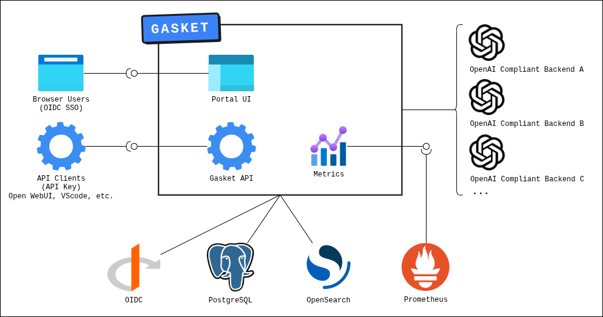

# Architecture

Gasket is a Python Flask application that acts as an authenticated proxy and portal for OpenAI-compliant inference backends.

## System Diagram

## Components

| Component         | Technology              | Purpose                                                                                                      |
| ----------------- | ----------------------- | ------------------------------------------------------------------------------------------------------------ |
| **Portal UI**     | HTML / CSS / JavaScript | Web interface for users and admins. Supports light and dark mode.                                            |
| **Gateway API**   | Python Flask            | Proxies and aggregates requests to configured OpenAI-compliant backends. Enforces access, quotas, and audit. |
| **PostgreSQL**    | PostgreSQL              | Stores API keys, user preferences, policy acceptance records, and per-user quota block status.               |
| **OpenSearch**    | OpenSearch              | Stores audit records (request metadata and optionally full request/response content).                        |
| **Prometheus**    | Prometheus              | Stores token usage and latency metrics.                                                                      |
| **OIDC Provider** | Any OIDC-compliant IdP  | Handles SSO login. OIDC groups control user access, admin panel access, and backend profile access.          |

## Technology Stack

- **Backend:** Python Flask
- **Frontend:** Plain HTML, CSS, and JavaScript — no external UI libraries or frameworks
- **Containerisation:** Docker / Docker Compose
- **Deployment:** Kubernetes via Helm charts
- **Ingress:** Traefik (in the development environment)

## High Availability

Gasket supports multiple instances running concurrently sharing the same PostgreSQL, Prometheus, and OpenSearch integrations. The app metrics endpoint aggregates data across all instances by querying the PostgreSQL database before responding, ensuring consistent metrics regardless of which instance is scraped.

The development environment provides a high-availability Docker Compose configuration with three Gasket instances on ports `5000`, `5001`, and `5002`, fronted by Traefik for load balancing.

## Endpoints

| Endpoint       | Description                                                          |
| -------------- | -------------------------------------------------------------------- |
| `/`            | Portal UI                                                            |
| `/keys`        | Portal API key management UI                                         |
| `/api/*`       | Portal JSON API                                                      |
| `/auth/*`      | OIDC login callback routes                                           |
| `/admin/*`     | Admin panel UI routes                                                |
| `/admin/api/*` | Admin JSON API                                                       |
| `/health`      | Health check — returns `200 OK` (Port `5000`)                        |
| `/metrics`     | Prometheus metrics (aggregated) (Port `9050` via `metrics_server.py`)|
| `/health`      | Metrics server health check (Port `9050` via `metrics_server.py`)    |
