# Gasket Gateway Demo

The following screenshots demonstrate the core user interfaces of the Gasket Gateway.

## User Portal

The user portal is where consumers of the API can view their allowed access, manage their API keys, and review the policies they have agreed to.

### Portal Dashboard
The dashboard provides a quick overview of connection health and usage metrics (once metrics are implemented).

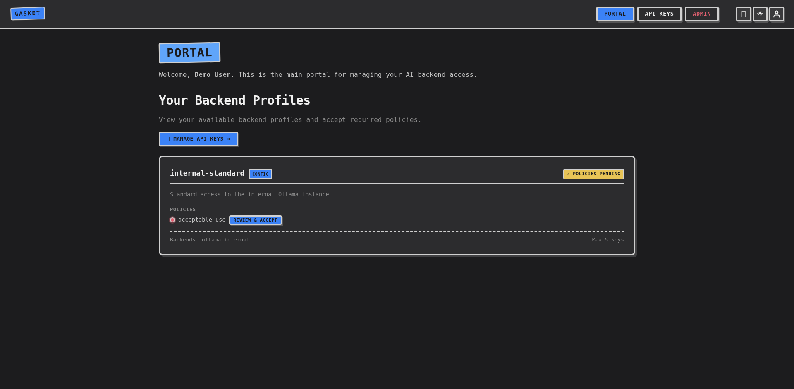

### Backend Profiles
Users can view the backend profiles they have been granted access to via their group memberships.

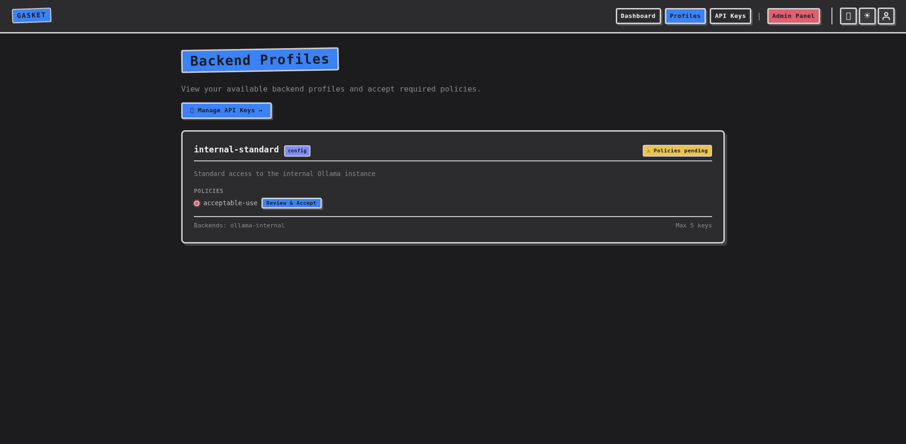

### API Keys
Users can generate and revoke their own API keys, scoping them to specific backend profiles they have been granted access to.

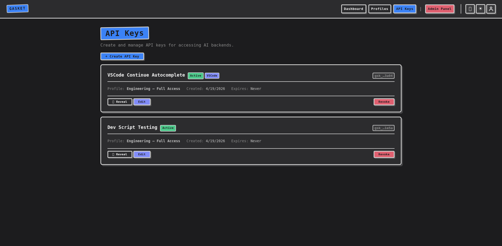

### Creating an API Key
A modal interface allows users to name their key, select a backend profile, and set an expiry date.

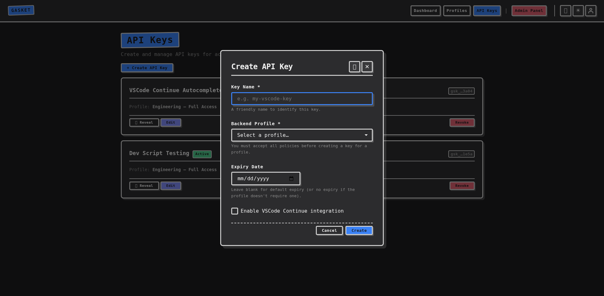

---

## Admin Panel

The admin panel is restricted to users in the `gasket-admins` group and provides full control over the gateway's configuration and access management.

### Status Overview
A high-level view of system component health.

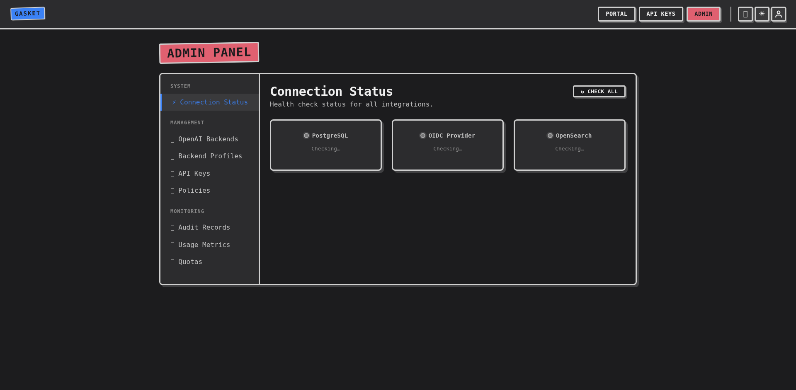

### OpenAI Backends
Define the upstream inference endpoints (e.g. internal vLLM clusters or external APIs like OpenAI).

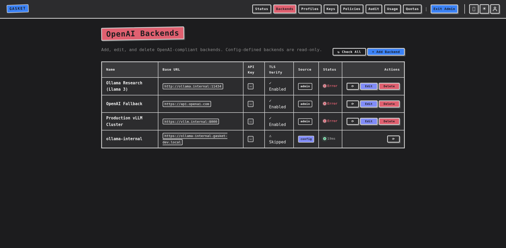

### Adding a Backend
Admins can easily add new inference endpoints via a comprehensive modal form.

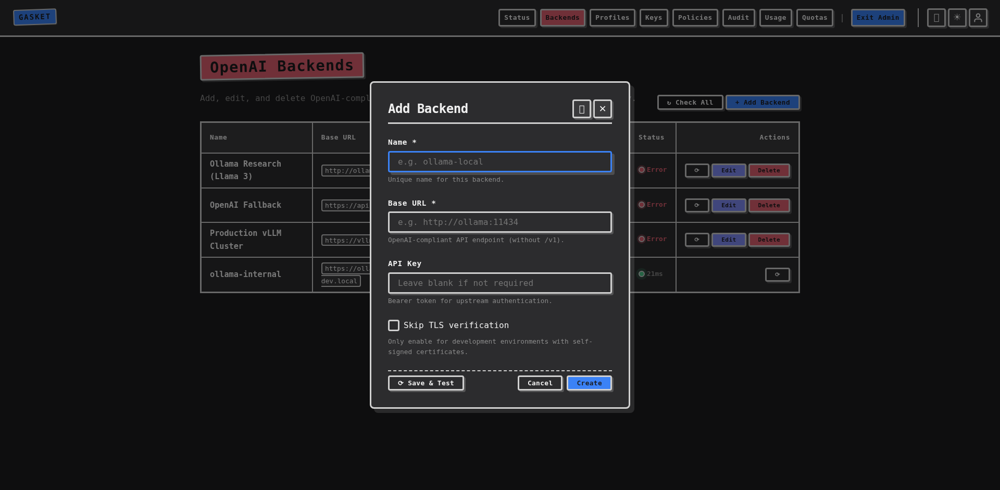

### Policies
Create and version terms-of-use policies that users must accept before using specific backend profiles.

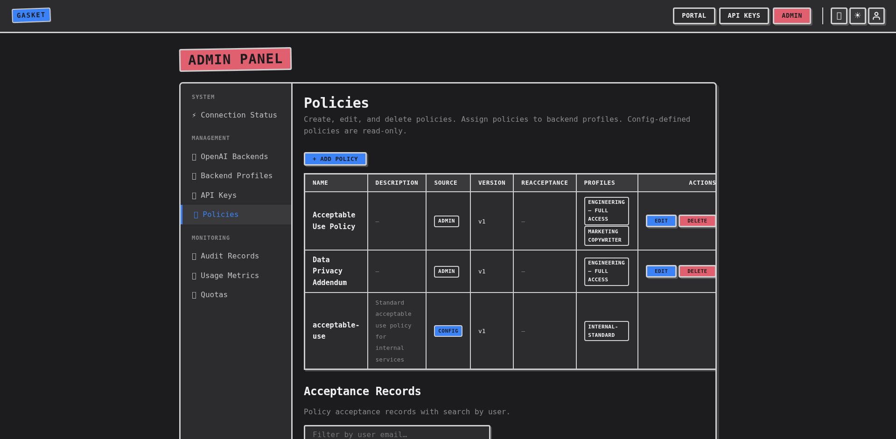

### Backend Profiles
Group backends together, assign mandatory policies, and configure audit logging or quota limits for specific user roles.

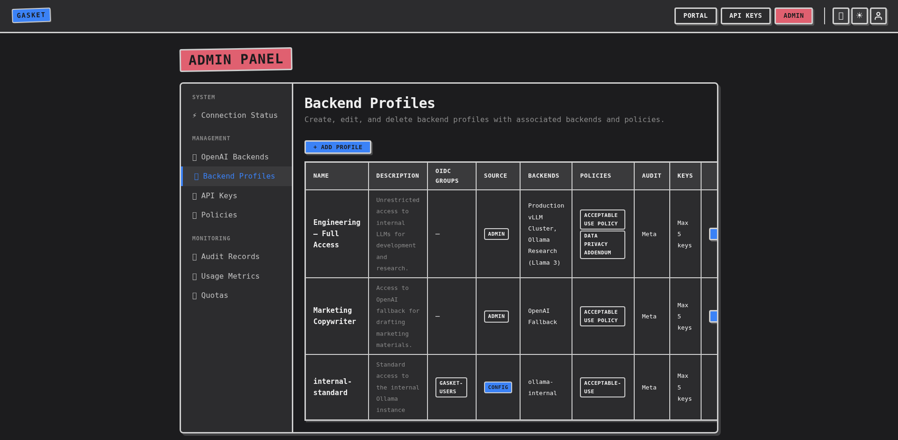

### Creating a Profile
The profile creation modal supports advanced settings like load balancing algorithms and quota enforcement.

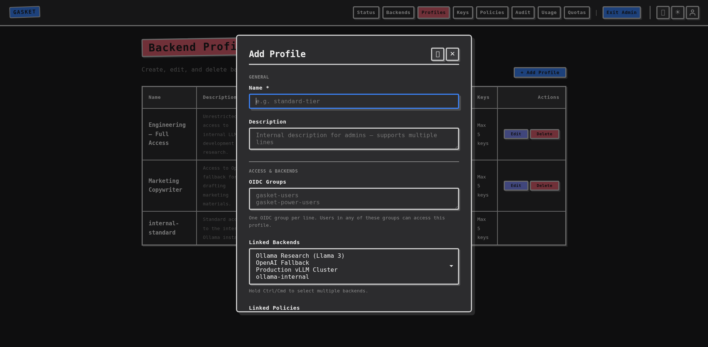

### API Key Management
View, revoke, or restore any API key across the entire system.

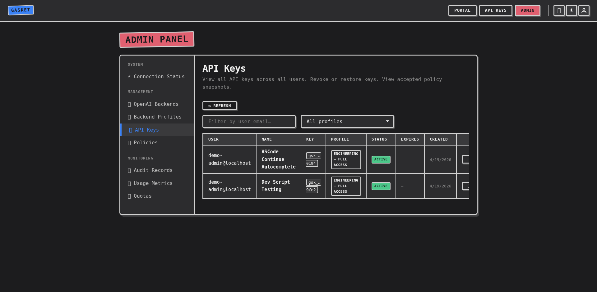

